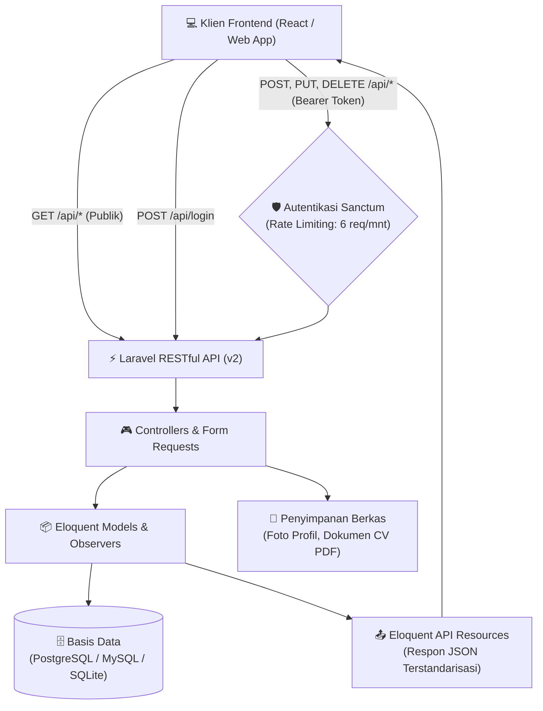

# 📄 Curriculum Vitae API (v2)

[](https://php.net)
[](https://laravel.com)
[](LICENSE)

[English](README.md) | **Bahasa Indonesia**

RESTful API yang dibangun menggunakan framework Laravel untuk mengelola data Curriculum Vitae, resume, dan portofolio pribadi (pengalaman kerja, riwayat pendidikan, keahlian, proyek, sertifikat, studi kasus, dan lainnya).

---

## 💡 Latar Belakang & Motivasi

Aplikasi ini dikembangkan untuk memisahkan data portofolio dan rekam jejak profesional pribadi dari antarmuka presentasi (_decoupled / headless architecture_). Dibandingkan pendekatan tradisional berbasis data statis atau monolitik, API ini menawarkan:

- **Pemisahan Peran (_Decoupled Architecture_)**: Backend fokus menangani validasi data, logika bisnis, integritas relasi, dan keamanan, sedangkan frontend (seperti [curriculum-vitae-react-v2](https://github.com/AfrizaHanif/curriculum-vitae-react-v2)) berfokus menyajikan antarmuka pengguna yang interaktif dan responsif.
- **Pusat Data Tunggal (_Single Source of Truth_)**: Seluruh informasi profil, pengalaman karir, proyek, hingga tautan dokumen resume tersimpan terpusat dan dapat dikonsumsi oleh berbagai platform (klien web, aplikasi mobile, atau layanan eksternal).
- **Keamanan & Kontrol Penuh**: Dilengkapi proteksi autentikasi berbasis token Sanctum, pembatasan laju login (_rate limiting_), serta fitur penghapusan aman (_soft delete_) dan pemulihan data (_restore_).

---

## 🏗️ Pratinjau & Arsitektur Sistem

Diagram berikut mengilustrasikan alur komunikasi antara klien antarmuka dengan layer API backend:



### Contoh Format Respon API Terstandarisasi

Panggilan publik ke `GET /api/skills`:

```json
{
    "data": [
        {
            "id": "SKI-002",
            "name": "Laravel",
            "type": "backend",
            "display_order": 1
        }
    ]
}
```

---

## 🚀 Fitur Utama

- **Autentikasi**: Autentikasi berbasis token menggunakan Laravel Sanctum dengan proteksi pembatasan login (`throttle:6,1`, maksimal 6 percobaan per menit).
- **Endpoint Portofolio**: Endpoint CRUD RESTful untuk mengelola pengalaman, pendidikan, keahlian, proyek, sertifikasi, studi kasus, dan testimoni.
- **Soft Delete & Restore**: Penghapusan sementara dengan filter data terhapus (`?trashed=with|only`), hapus permanen (`?force=true`), dan pemulihan data (`{resource}/{id}/restore`).
- **Respon Terstandarisasi**: Pemanfaatan Eloquent API Resources untuk format respon JSON yang seragam di semua endpoint.
- **Tooling Pengembangan**: Pengujian otomatis dengan Pest, analisis statis dengan PHPStan, dan formatting kode dengan Laravel Pint.

---

## 🛠️ Kebutuhan Sistem

- **PHP**: `^8.3` (atau lebih tinggi, contoh: PHP 8.5)
    - Ekstensi yang diperlukan: `OpenSSL`, `PDO`, `Mbstring`, `Tokenizer`, `XML`, `Ctype`, `JSON`, `BCMath`
- **Composer**: `^2.x`
- **Node.js**: `^20.x` & **npm**
- **Basis Data (Database)**: PostgreSQL / MySQL / MariaDB / SQLite

---

## 📦 Panduan Instalasi & Menjalankan Proyek

### 1. Kloning Repositori

```bash
git clone https://github.com/AfrizaHanif/curriculum-vitae-api-v2.git
cd curriculum-vitae-api-v2
```

### 2. Instalasi Otomatis (Direkomendasikan)

Gunakan skrip instalasi bawaan Composer:

```bash
composer run setup
php artisan storage:link
```

> [!NOTE]
> Skrip instalasi otomatis melakukan migrasi skema database tanpa seeder. Jika Anda ingin mengisi data awal portofolio dan akun administrator default, jalankan:
>
> ```bash
> php artisan db:seed
> ```

### 3. Instalasi Manual

```bash
# Instal dependensi PHP & Node
composer install
npm install

# Buat file konfigurasi environment
cp .env.example .env
php artisan key:generate

# Konfigurasikan koneksi database di file .env, lalu jalankan migrasi & seeder:
php artisan migrate --seed

# Buat tautan simbolik direktori penyimpanan file (foto, berkas resume)
php artisan storage:link

# Kompilasi aset frontend
npm run build
```

### 4. Menjalankan Server Pengembangan

```bash
composer run dev
# atau
php artisan serve
```

API dapat diakses melalui: `http://localhost:8000/api`.

---

## 📁 Struktur Proyek

Struktur direktori utama yang mengelola logika dan layanan API:

```text
curriculum-vitae-api-v2/
├── app/
│   ├── Enums/                 # Enum status dan klasifikasi kategori
│   ├── Http/
│   │   ├── Controllers/Api/   # Controller endpoint API (CRUD & Autentikasi)
│   │   ├── Middleware/        # Middleware custom aplikasi
│   │   ├── Requests/          # Validasi request body & rules
│   │   └── Resources/         # Eloquent API Resources (format respon JSON)
│   ├── Models/                # Model Eloquent & definisi relasi
│   ├── Observers/             # Observer siklus hidup model
│   ├── Policies/              # Kebijakan otorisasi hak akses
│   └── Traits/                # Trait reusable (penanganan slug, filter, dll.)
├── database/
│   ├── factories/             # Factory untuk pembuatan data uji otomatis
│   ├── migrations/            # Skema dan tabel basis data
│   └── seeders/               # Seeder data portofolio awal
├── routes/
│   └── api.php                # Definisi seluruh rute dan grup endpoint API
└── tests/
    ├── Feature/               # Pengujian fungsionalitas endpoint API (Pest)
    └── Unit/                  # Pengujian unit logic
```

---

## 🔑 Autentikasi

Endpoint yang dilindungi (menambah, mengubah, menghapus, atau memulihkan data) memerlukan Bearer token pada header permintaan HTTP:

```http
Authorization: Bearer <token-akses-anda>
Accept: application/json
```

> [!NOTE]
> Endpoint pembacaan data (`GET /api/*`) bersifat publik dan tidak memerlukan autentikasi.

### Login

- **POST** `/api/login`
- **Request Body** (kredensial bawaan hasil seeder dari `.env`):

    ```json
    {
        "email": "admin@example.com",
        "password": "password"
    }
    ```

- **Respon Sukses**:

    ```json
    {
        "status": "success",
        "token": "1|xxxxxxxxxxxxxxxxxxxxxxxxxxxx",
        "token_type": "Bearer"
    }
    ```

### Logout

- **POST** `/api/logout` (Memerlukan Bearer token)

---

## 📡 Daftar Endpoint API

### Status Sistem / Health Check

- `GET /api/` — Pengecekan status server, versi API, dan timestamp (Publik).

### Profil

- `GET /api/profiles` — Mengambil daftar data profil (Publik).
- `GET /api/profiles/{id}` — Mengambil detail profil tertentu (Publik).
- `PUT/PATCH /api/profiles/{id}` — Memperbarui data profil (Memerlukan Bearer token).

### Data Resource Utama

Seluruh resource di bawah ini menggunakan konvensi RESTful `apiResource`. Permintaan `GET` (`index` dan `show`) bersifat publik, sedangkan operasi penulisan data (`store`, `update`, `destroy`, `restore`) wajib menggunakan Bearer token:

| Endpoint            | Deskripsi                       |
| :------------------ | :------------------------------ |
| `/api/skills`       | Keahlian teknis dan soft skills |
| `/api/educations`   | Riwayat pendidikan              |
| `/api/experiences`  | Pengalaman kerja dan karir      |
| `/api/expertises`   | Bidang keahlian utama           |
| `/api/certificates` | Sertifikasi dan lisensi         |
| `/api/projects`     | Daftar proyek dan repositori    |
| `/api/portfolios`   | Item portofolio dan media karya |
| `/api/case-studies` | Studi kasus mendalam            |
| `/api/posts`        | Artikel dan publikasi tulisan   |
| `/api/features`     | Item sorotan / fitur unggulan   |
| `/api/hobbies`      | Minat dan hobi pribadi          |
| `/api/setups`       | Peralatan kerja / workstation   |
| `/api/socials`      | Tautan media sosial dan kontak  |
| `/api/testimonials` | Rekomendasi dan testimoni       |

#### Operasi Soft Delete & Pemulihan Data

Parameter `{resource}` mengacu pada nama endpoint jamak/plural (contoh: `skills`, `projects`):

- **Menampilkan data termasuk yang dihapus**: `GET /api/{resource}?trashed=with`
- **Hanya menampilkan data yang dihapus**: `GET /api/{resource}?trashed=only`
- **Hapus sementara (soft delete)**: `DELETE /api/{resource}/{id}`
- **Hapus permanen**: `DELETE /api/{resource}/{id}?force=true`
- **Memulihkan data (restore)**: `POST /api/{resource}/{id}/restore` (contoh: `POST /api/skills/1/restore`)

---

## 🧪 Pengujian & Kualitas Kode

### Menjalankan Test Suite

```bash
# Menjalankan test suite Pest saja:
php artisan test

# Atau menjalankan seluruh pipeline QA (clear config, cek format Pint, analisis tipe PHPStan, dan Pest):
composer run test
```

### Analisis Statis Kode (PHPStan)

```bash
composer run types:check
```

### Standarisasi Format Kode (Laravel Pint)

```bash
composer run lint
# atau untuk mengecek tanpa auto-fix:
composer run lint:check
```

---

## 🤝 Alur Pengembangan & Kolaborasi

Meskipun repositori ini ditujukan untuk data portofolio pribadi, masukan, saran fitur, atau pelaporan _bug_ sangat kami hargai.

1. **Fork & Buat Branch**:

    ```bash
    git checkout -b fitur/nama-fitur-baru
    ```

2. **Jalankan Uji & Format Kode**:
   Pastikan kode baru lulus uji fungsionalitas dan sesuai dengan standar format:

    ```bash
    composer run lint
    composer run test
    ```

3. **Kirim Pull Request**:
   Buat Pull Request dengan penjelasan ringkas mengenai perubahan atau perbaikan yang diajukan. Untuk pelaporan kendala, silakan gunakan [GitHub Issues](https://github.com/AfrizaHanif/curriculum-vitae-api-v2/issues).

---

## 📬 Kontak & Media Sosial

Pengembang & Pengelola: **Muhammad Afriza Hanif**

- **GitHub**: [@AfrizaHanif](https://github.com/AfrizaHanif)
- **LinkedIn**: [Muhammad Afriza Hanif](https://linkedin.com/in/afrizahanif)
- **Frontend Terkait**: [curriculum-vitae-react-v2](https://github.com/AfrizaHanif/curriculum-vitae-react-v2)

---

## 📄 Lisensi

- **Kode Sumber (Source Code)**: Dilindungi di bawah lisensi [MIT License](LICENSE).
- **Konten & Data Pribadi**: Hak cipta dilindungi undang-undang (_All Rights Reserved_) oleh **Muhammad Afriza Hanif**. Informasi profil pribadi, foto, dan riwayat karir pribadi tidak boleh digunakan untuk tujuan komersial atau peniruan identitas.
