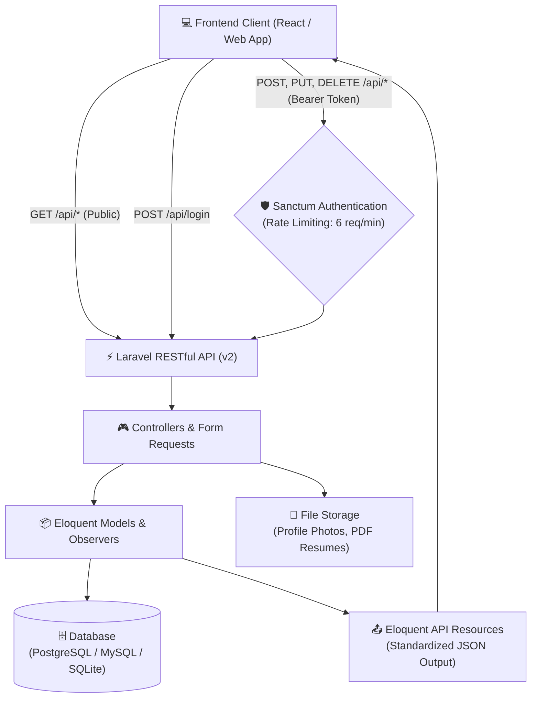

# 📄 Curriculum Vitae API (v2)

[](https://php.net)
[](https://laravel.com)
[](LICENSE)

**English** | [Bahasa Indonesia](README.id.md)

A RESTful API built with Laravel for managing personal curriculum vitae, resume, and portfolio data (experiences, education, skills, projects, certificates, case studies, and more).

---

## 💡 Background & Motivation

This project was developed to decouple personal portfolio and curriculum vitae data from the presentation layer (_decoupled / headless architecture_). Compared to static files or tightly-coupled monolithic approaches, this RESTful API provides:

- **Decoupled Architecture**: The backend focuses purely on business logic, validation rules, relational data integrity, and security, allowing frontend clients (such as [curriculum-vitae-react-v2](https://github.com/AfrizaHanif/curriculum-vitae-react-v2)) to focus on rendering dynamic and responsive user experiences.
- **Single Source of Truth**: All profile information, career history, projects, and resume files are managed centrally and can be consumed by multiple platforms (web client, mobile apps, or external integrations).
- **Security & Full Control**: Self-hosted data management equipped with Sanctum token authentication, login brute-force rate limiting, and safe soft deletion/restore capabilities.

---

## 🏗️ Preview & System Architecture

The following diagram illustrates the interaction between client applications and the Laravel API backend:



### Standardized API Response Example

A public request to `GET /api/skills`:

```json
{
    "data": [
        {
            "id": "SKI-002",
            "name": "Laravel",
            "type": "backend",
            "display_order": 1
        }
    ]
}
```

---

## 🚀 Features

- **Authentication**: Token-based authentication using Laravel Sanctum with rate-limited login endpoints (`throttle:6,1`, max 6 attempts per minute).
- **Portfolio Endpoints**: RESTful CRUD endpoints for experiences, education, skills, projects, certificates, case studies, and testimonials.
- **Soft Deletion & Restore**: Soft deletes with support for trashed filtering (`?trashed=with|only`), force deletion (`?force=true`), and restore endpoints (`{resource}/{id}/restore`).
- **Standardized Responses**: Eloquent API Resources for consistent response formats across all endpoints.
- **Developer Tooling**: Pest test suite, PHPStan static analysis, and Laravel Pint code formatting.

---

## 🛠️ Requirements

- **PHP**: `^8.3` (or higher, e.g. PHP 8.5)
    - Extensions: `OpenSSL`, `PDO`, `Mbstring`, `Tokenizer`, `XML`, `Ctype`, `JSON`, `BCMath`
- **Composer**: `^2.x`
- **Node.js**: `^20.x` & **npm**
- **Database**: PostgreSQL / MySQL / MariaDB / SQLite

---

## 📦 Installation & Setup

### 1. Clone Repository

```bash
git clone https://github.com/AfrizaHanif/curriculum-vitae-api-v2.git
cd curriculum-vitae-api-v2
```

### 2. Automated Setup (Recommended)

You can use the built-in composer setup script:

```bash
composer run setup
php artisan storage:link
```

> [!NOTE]
> The automated setup migrates the database without seeding. If you want initial demo/portfolio data and default admin credentials, run:
>
> ```bash
> php artisan db:seed
> ```

### 3. Manual Setup

```bash
# Install PHP & Node dependencies
composer install
npm install

# Setup environment file
cp .env.example .env
php artisan key:generate

# Configure your database in .env, then run migrations and seeders:
php artisan migrate --seed

# Create storage symbolic link for file uploads (photos, resumes)
php artisan storage:link

# Build frontend assets
npm run build
```

### 4. Running the Development Server

```bash
composer run dev
# or
php artisan serve
```

The API is served at `http://localhost:8000/api`.

---

## 📁 Project Structure

Key architectural directories powering the API service:

```text
curriculum-vitae-api-v2/
├── app/
│   ├── Enums/                 # Enum definitions (skill levels, categories)
│   ├── Http/
│   │   ├── Controllers/Api/   # API controllers (CRUD & Authentication)
│   │   ├── Middleware/        # Custom application middleware
│   │   ├── Requests/          # Request validation rules & logic
│   │   └── Resources/         # Eloquent API Resources (standardized JSON)
│   ├── Models/                # Eloquent models & relationship definitions
│   ├── Observers/             # Model lifecycle observers
│   ├── Policies/              # Authorization policies
│   └── Traits/                # Reusable traits (slug handling, query filters)
├── database/
│   ├── factories/             # Model factories for automated testing
│   ├── migrations/            # Database schema migrations
│   └── seeders/               # Initial portfolio seeders
├── routes/
│   └── api.php                # API route definitions & route groups
└── tests/
    ├── Feature/               # Endpoint feature integration tests (Pest)
    └── Unit/                  # Unit logic tests
```

---

## 🔑 Authentication

Protected endpoints (creating, updating, deleting, or restoring records) require a Bearer token in the `Authorization` header:

```http
Authorization: Bearer <your-access-token>
Accept: application/json
```

> [!NOTE]
> Read-only endpoints (`GET /api/*`) are public and do not require authentication.

### Login

- **POST** `/api/login`
- **Payload** (default seeded credentials from `.env`):

    ```json
    {
        "email": "admin@example.com",
        "password": "password"
    }
    ```

- **Response**:

    ```json
    {
        "status": "success",
        "token": "1|xxxxxxxxxxxxxxxxxxxxxxxxxxxx",
        "token_type": "Bearer"
    }
    ```

### Logout

- **POST** `/api/logout` (Requires Bearer token)

---

## 📡 API Endpoints

### System / Health Check

- `GET /api/` — API health check, version, and server timestamp (Public).

### Profile

- `GET /api/profiles` — List profile data (Public).
- `GET /api/profiles/{id}` — Get single profile (Public).
- `PUT/PATCH /api/profiles/{id}` — Update profile (Requires Bearer token).

### Core Resources

All resources below follow standard RESTful `apiResource` conventions. `GET` requests (`index` and `show`) are public, while write operations (`store`, `update`, `destroy`, `restore`) require a Bearer token:

| Endpoint            | Description                       |
| :------------------ | :-------------------------------- |
| `/api/skills`       | Technical and soft skills         |
| `/api/educations`   | Educational history               |
| `/api/experiences`  | Work and career experiences       |
| `/api/expertises`   | Core expertise and domains        |
| `/api/certificates` | Certifications and licenses       |
| `/api/projects`     | Project listings and repositories |
| `/api/portfolios`   | Portfolio items and media         |
| `/api/case-studies` | In-depth case studies             |
| `/api/posts`        | Articles and publications         |
| `/api/features`     | Highlighted features and items    |
| `/api/hobbies`      | Personal interests & hobbies      |
| `/api/setups`       | Workstation and equipment setups  |
| `/api/socials`      | Social media and contact links    |
| `/api/testimonials` | Recommendations and testimonials  |

#### Soft Delete & Restore Operations

The `{resource}` parameter refers to the plural resource name (e.g. `skills`, `projects`):

- **Include soft-deleted records**: `GET /api/{resource}?trashed=with`
- **Show only soft-deleted records**: `GET /api/{resource}?trashed=only`
- **Soft delete record**: `DELETE /api/{resource}/{id}`
- **Permanently delete record**: `DELETE /api/{resource}/{id}?force=true`
- **Restore soft-deleted item**: `POST /api/{resource}/{id}/restore` (e.g. `POST /api/skills/1/restore`)

---

## 🧪 Testing & Code Quality

### Run Test Suite

```bash
# Run Pest test suite only:
php artisan test

# Or run the full QA pipeline (config clear, Pint lint check, PHPStan type check, and Pest tests):
composer run test
```

### Static Analysis (PHPStan)

```bash
composer run types:check
```

### Code Formatting (Laravel Pint)

```bash
composer run lint
# or to inspect issues without fixing:
composer run lint:check
```

---

## 🤝 Development & Contributing Workflow

While this project primarily serves personal portfolio data, feedback, feature ideas, and bug reports are welcome.

1. **Fork & Branch**:

    ```bash
    git checkout -b feature/your-feature-name
    ```

2. **Test & Format**:
   Ensure all tests pass and code style adheres to project standards:

    ```bash
    composer run lint
    composer run test
    ```

3. **Submit a Pull Request**:
   Open a PR detailing your changes. For issues or suggestions, please use [GitHub Issues](https://github.com/AfrizaHanif/curriculum-vitae-api-v2/issues).

---

## 📬 Contact & Social Media

Developed & Maintained by: **Muhammad Afriza Hanif**

- **GitHub**: [@AfrizaHanif](https://github.com/AfrizaHanif)
- **LinkedIn**: [Muhammad Afriza Hanif](https://linkedin.com/in/afrizahanif)
- **Related Frontend**: [curriculum-vitae-react-v2](https://github.com/AfrizaHanif/curriculum-vitae-react-v2)

---

## 📄 License

- **Source Code**: Licensed under the [MIT License](LICENSE).
- **Personal Content & Data**: All rights reserved by **Muhammad Afriza Hanif**. You may not use the personal profile information, photos, or personal career history for commercial purposes or impersonation.
